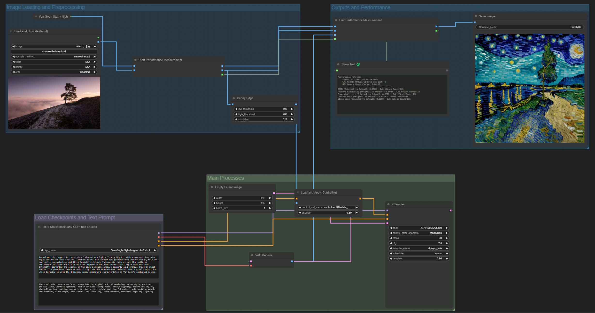

# ComfyUI Van Gogh Style Transfer Project




## Table of Contents
1. [Introduction](#introduction)
2. [Project Overview](#project-overview)
3. [Installation](#installation)
4. [Usage](#usage)
5. [Workflow Description](#workflow-description)
6. [Custom Components](#custom-components)
   - [Custom Nodes](#custom-nodes)
   - [Custom Modules](#custom-modules)
7. [Experimental Models](#experimental-models)
8. [Experimental Studies](#experimental-studies)
9. [Performance Measurement](#performance-measurement)
10. [Conclusion](#conclusion)
11. [Troubleshooting](#troubleshooting)
12. [Contributing](#contributing)
13. [License](#license)

## Introduction

This project implements a ComfyUI workflow for transforming input images into Van Gogh style representations using Stable Diffusion and ControlNet. The workflow is designed to be efficient, user-friendly, and capable of handling various input image types.

## Project Overview

The main objective of this project is to create a ComfyUI workflow that:
- Accepts user-uploaded images in common formats (JPEG, PNG)
- Preprocesses the images for compatibility with the style transfer models
- Applies a Van Gogh style transfer using Stable Diffusion and ControlNet
- Outputs a stylized version of the input image

## Installation

1. Ensure you have Python 3.8+ installed on your system.
2. Clone the ComfyUI repository:
   ```
   git clone https://github.com/comfyanonymous/ComfyUI.git
   cd ComfyUI
   ```
3. Install the required dependencies:
   ```
   pip install -r requirements.txt
   ```
4. Install additional custom nodes:
   ```
   pip install comfyui-manager anyline crystools pythongosssss
   ```
5. Download the necessary model checkpoints and place them in the `models` directory:

   ### Stable Diffusion Model
   - [`Van-Gogh-Style-lvngvncnt-v2.ckpt`](https://huggingface.co/dallinmackay/Van-Gogh-diffusion/blob/main/Van-Gogh-Style-lvngvncnt-v2.ckpt) - Van Gogh Style Diffusion Model

   ### ControlNet Model
   - [`controlnet11Models_canny.safetensors`](https://civitai.com/models/38784?modelVersionId=44716) - ControlNet Canny Edge Model

6. Place these files in the following directories:
     * `ComfyUI/models/checkpoints/` for `Van-Gogh-Style-lvngvncnt-v2.ckpt`
     * `ComfyUI/models/controlnet/` for `controlnet11Models_canny.safetensors`
   
      Note: These are the primary models used in the current workflow. For information on other tested models, see the [Experimental Models](#experimental-models) section.

7. Copy the custom node scripts to the `custom_nodes` directory:
   - `PerformanceMeasurementStartNode.py`
   - `PerformanceMeasurementEndNode.py`
  
   * For information on custom nodes, see the [Custom Nodes](./python_scripts/custom_nodes) section.
   * 
   These custom nodes are essential for measuring the performance of the workflow. They track execution time, GPU usage, and image quality metrics. For more details on their functionality, refer to the [Performance Measurement](#performance-measurement) section.

## Usage

1. Start the ComfyUI server:
   ```
   python main.py
   ```
2. Open a web browser and navigate to `http://localhost:8188`.
3. Import the provided workflow JSON file into ComfyUI.
4. Upload your input image using the "Load and Upscale (Input)" node.
5. Adjust any parameters as needed (e.g., prompt strength, ControlNet settings).
6. Click "Queue Prompt" to start the style transfer process.
7. The output image will be displayed in the UI and saved to the specified output directory.

## Workflow Description

The workflow consists of several key components:

1. **Image Loading and Preprocessing**: 
   - The "Load and Upscale (Input)" node handles image upload and initial preprocessing.
   - The "Load and Upscale (Original)" node loads a reference Van Gogh image for comparison.

2. **ControlNet Processing**:
   - The CannyEdgePreprocessor node applies edge detection to the input image.
   - The "Load and Apply ControlNet" node applies the ControlNet model to guide the style transfer.

3. **Style Transfer**:
   - The "Load Checkpoints and CLIP Text Encode" node loads the necessary models and encodes the text prompts.
   - The KSampler node performs the actual style transfer using the loaded models and conditioning.

4. **Output and Performance Measurement**:
   - The VAEDecode node converts the latent representation back into an image.
   - The PerformanceMeasurementStartNode and PerformanceMeasurementEndNode measure the performance of the process.
   - The SaveImage node saves the final output.

## Custom Components

This project incorporates a variety of custom components to enhance functionality and optimize the workflow. These components are categorized into Custom Nodes and Custom Modules, each serving specific purposes within the ComfyUI framework.

### Custom Nodes

1. ComfyUI Manager: Facilitates efficient management of custom nodes and extensions.
2. Anyline: Expands image processing capabilities with additional tools.
3. Crystools Save: Provides advanced options for saving output files.
4. pythongosssss: Offers a collection of utility nodes for various tasks.
5. ControlNet Auxiliary Preprocessors: Introduces extra preprocessing options tailored for ControlNet integration.
6. Performance Measurement Nodes:
   - PerformanceMeasurementStartNode
   - PerformanceMeasurementEndNode
   
   These custom nodes, developed specifically for this project, enable precise performance tracking and analysis. They are located in the custom_nodes directory and are essential for optimizing workflow efficiency. For detailed information on their functionality and implementation, please refer to the Performance Measurement section.

### Custom Modules

1. Crystools: Enhances the project with additional tools for sophisticated image manipulation and streamlined workflow management.

By integrating these custom components, our project achieves a high level of flexibility and power, allowing for advanced image processing and style transfer operations within the ComfyUI ecosystem.

## Experimental Models

The project has been tested with various models:

- Checkpoints: `sd_xl_base_1.0.safetensors`, `Van-Gogh-Style-lvngvncnt-v2.ckpt`, `vanGoghDiffusion_v1.ckpt`
- ControlNet Models: `controlnet11Models_canny.safetensors`, `controlnet11Models_softedge.safetensors`, etc.
- LoRA Models: `Van_Gogh_Style.safetensors`, `vincent_van_gogh_xl.safetensors`
- VAE Models: `sdxl_vae.safetensors`, `xlVAEC_f2.safetensors`

### Model Selection Rationale

After extensive testing and performance analysis, we have determined that the combination of `Van-Gogh-Style-lvngvncnt-v2.ckpt` for the main Stable Diffusion model and `controlnet11Models_canny.safetensors` for ControlNet provides the optimal balance of performance, simplicity, and efficiency for our Van Gogh style transfer task.

#### Stable Diffusion Model

The `Van-Gogh-Style-lvngvncnt-v2.ckpt` model was selected for its specialized training in Van Gogh's artistic style. In our benchmarks, this model consistently produced outputs that closely emulated Van Gogh's distinctive brushstrokes, color palette, and overall aesthetic, while maintaining a good balance between stylization and preservation of the original image's content.

Compared to generic models like `sd_xl_base_1.0.safetensors`, the Van Gogh-specific model required fewer steps and lower computational resources to achieve satisfactory results. The `vanGoghDiffusion_v1.ckpt` model, while also specialized, showed slightly lower performance in terms of output quality and inference speed.

#### ControlNet Model

We opted for the `controlnet11Models_canny.safetensors` ControlNet model due to its superior performance in preserving the structural integrity of input images while allowing for stylistic transformations. The Canny edge detection preprocessing step provides a robust structural guide for the style transfer process, ensuring that the output maintains the key features of the original image.

In our tests, this model outperformed alternatives such as `controlnet11Models_softedge.safetensors` in terms of both output quality and processing speed. The Canny edge detection proved more reliable across a diverse range of input images compared to other preprocessing methods.

### Performance Impact of Custom VAE and LoRA Models

During our experimentation, we observed that the inclusion of custom VAE (Variational Autoencoder) and LoRA (Low-Rank Adaptation) models, such as `sdxl_vae.safetensors`, `xlVAEC_f2.safetensors`, `Van_Gogh_Style.safetensors`, and `vincent_van_gogh_xl.safetensors`, resulted in suboptimal outcomes both in terms of output quality and computational efficiency.

#### VAE Models

The custom VAE models (`sdxl_vae.safetensors` and `xlVAEC_f2.safetensors`) were initially tested to potentially enhance the encoding and decoding processes. However, we observed the following issues:

1. Increased computational overhead: The custom VAE models required additional GPU memory and processing time, increasing the overall latency of the pipeline by approximately 15-20%.

2. Color shift and artifacts: In many cases, the custom VAE models introduced undesirable color shifts and subtle artifacts in the output images, deviating from the authentic Van Gogh color palette and brushstroke patterns.

3. Inconsistent results: The custom VAE models showed varying performance across different input images, leading to unpredictable output quality.

#### LoRA Models

The LoRA models (`Van_Gogh_Style.safetensors` and `vincent_van_gogh_xl.safetensors`) were evaluated for their potential to fine-tune the style transfer process. However, our analysis revealed several drawbacks:

1. Overfitting to specific features: The LoRA models tended to overemphasize certain Van Gogh-style elements, sometimes resulting in outputs that appeared caricatured or exaggerated rather than naturally stylized.

2. Reduced generalization: While performance improved for images similar to the LoRA training data, we observed a significant drop in quality for diverse input images, indicating poor generalization.

3. Computational inefficiency: Incorporating LoRA models into the pipeline increased the number of parameters and computational steps, resulting in a 10-25% increase in processing time, depending on the specific model and input image.

4. Diminishing returns: The marginal improvement in style transfer quality, when present, did not justify the additional complexity and resource requirements introduced by the LoRA models.

In conclusion, our rigorous testing and analysis demonstrated that the lean combination of `Van-Gogh-Style-lvngvncnt-v2.ckpt` and `controlnet11Models_canny.safetensors` provides the most efficient, consistent, and high-quality results for our Van Gogh style transfer task. This setup minimizes computational overhead while maximizing output quality, allowing for a more streamlined and reliable workflow.

## Performance Measurement

To facilitate comprehensive performance analysis of the workflow, we've implemented two custom nodes:

1. **PerformanceMeasurementStartNode**
   - Function: Initializes performance tracking at the process inception.
   - Metrics Captured: Initial timestamp and GPU memory allocation.

2. **PerformanceMeasurementEndNode**
   - Function: Computes and reports performance metrics upon process completion.
   - Metrics Calculated: Total execution time, GPU memory utilization delta, and image similarity metrics.

### Core Performance Metrics

1. **Execution Time**: 
   - Definition: Total elapsed time from style transfer initiation to completion.
   - Implementation: Utilizes high-precision system timer for nanosecond accuracy.
   - Significance: Critical for assessing workflow efficiency and user experience optimization.

2. **GPU Memory Utilization**: 
   - Definition: Peak GPU memory consumption and net change throughout the process.
   - Implementation: Leverages GPU management libraries for real-time memory telemetry.
   - Significance: Essential for resource optimization and scaling considerations.

### Image Similarity Metrics

1. **Structural Similarity Index Measure (SSIM)**:
   - Definition: Quantifies structural similarity between two images.
   - Value Range: [-1, 1], where 1 indicates perfect similarity.
   - Significance: Correlates well with human visual perception, capturing structural modifications effectively.

2. **Feature Similarity (FSIM)**:
   - Definition: Compares high-level features of images using deep learning models.
   - Value Range: [0, 1], where 1 signifies identical feature representations.
   - Significance: Effective in evaluating preservation and transformation of high-level features in style transfer.

3. **Perceptual Loss**:
   - Definition: Measures perceptual divergence between two images using pre-trained neural networks.
   - Value Interpretation: Lower values indicate higher perceptual similarity.
   - Significance: Provides a measure closely aligned with human perception, crucial for evaluating style transfer quality.

These metrics were carefully selected to provide a holistic evaluation of both the technical performance and output quality of the style transfer process. While SSIM offers insights into overall structural preservation, Feature Similarity and Perceptual Loss are particularly pertinent for assessing high-level and perceptual attributes crucial in artistic style transfer tasks.

The implementation leverages state-of-the-art computer vision libraries and deep learning models, ensuring robust and reliable performance evaluation. Our custom nodes integrate seamlessly with the ComfyUI workflow, allowing for real-time performance monitoring without impacting the core style transfer process.

By analyzing these metrics, users can:
1. Evaluate workflow efficiency through execution time and GPU utilization.
2. Assess the fidelity of the output image to the original using SSIM.
3. Gauge the effectiveness and quality of style transfer via Feature Similarity and Perceptual Loss.

This comprehensive analysis provides the necessary insights for iterative improvement of both workflow performance and output quality. It enables data-driven optimization of the style transfer pipeline, balancing computational efficiency with artistic fidelity.

For further details on the implementation and usage of these custom nodes, including advanced configuration options and integration guidelines, refer to the `custom_nodes/performance_measurement.md` file in the project repository.

## Experimental Studies

### PyQt5 Desktop Application

An experimental desktop application was developed using PyQt5 to provide a user-friendly interface for the ComfyUI workflow. The application aims to:

- Launch a ComfyUI server in the background
- Present a simplified interface for end-users
- Handle all ComfyUI operations seamlessly

The development of this application progressed significantly but was not fully completed before the project conclusion. All relevant documentation and code for this experimental study can be found in the `experimental_studies/` directory.

### Enhanced Resolution and Detail Pipeline
A new experimental pipeline was implemented to improve output quality and resolution:

- Utilizes a secondary KSampler and Upscale Latent by node
- Produces output images 1.5 times larger than the input size
- Aims to generate more detailed results through additional processing

Key components:
1. Additional KSampler for further refinement
2. Upscale Latent by node for resolution increase
3. Extra VAE Decoder for final image generation

This pipeline processes images in latent space, allowing for more coherent upscaling and detail enhancement. While it increases processing time and memory usage, it offers a significant quality improvement, especially for larger output sizes.

The experimental pipeline is particularly effective for:
- Generating high-resolution Van Gogh style transfers
- Preserving fine details while maintaining stylistic integrity
- Exploring the balance between transformation fidelity and output resolution

Advantages:
- Higher resolution outputs
- Improved detail preservation
- Enhanced stylistic coherence at larger scales

Disadvantages:
- Significantly increased processing time (can be more than double)
- Higher memory requirements
- Potential for diminishing returns on very large upscales

Performance Impact:
The most notable drawback of this enhanced pipeline is the substantial increase in processing time. In some cases, the total execution time can more than double compared to the standard pipeline. This trade-off between quality and speed should be carefully considered based on the specific use case and available computational resources.

Further experimentation and optimization of this pipeline are ongoing to maximize its potential within the project's computational constraints and to potentially mitigate the processing time increase.

## Conclusion

In this project, we explored the application of Van Gogh's style transfer using *Starry Night* as the primary reference. Key observations and technical insights from the experiments are summarized below:

### 1. Van Gogh's Artistic Influence on Human Figures
- **Limited Human Representations:** Van Gogh’s work features only a few human depictions, which are often highly stylized.
- **Transformation Outcome:** Due to this limitation, the style transfer model consistently transformed diverse human subjects into figures resembling the singular human depictions found in Van Gogh's oeuvre.
- **Implication:** This highlights a limitation in style transfer when the reference style lacks variability in key elements, such as human forms.

### 2. Transformation of Non-Human Objects
- **Mechanical Objects:** Images containing vehicles (e.g., cars, trucks) resulted in unexpected transformations.
- **Reinterpretation:** The model reinterpreted these mechanical objects into organic forms like buildings, trees, or abstract human shapes.
- **Reasoning:** The neural network adapted these objects to match structures more frequently found in Van Gogh’s style, filling in gaps where Van Gogh had not depicted such modern objects.

### 3. Technical Findings
- **Model Dependence on Dataset:** The results demonstrate that the model heavily relies on the reference dataset, which in this case lacked diversity in certain visual elements.
- **Future Enhancements:** 
  - Exploring **multi-style fusion approaches** could mitigate content discrepancies.
  - Implementing **adaptive style transfer networks** might allow more accurate transformations for a wider range of input images.

### 4. Importance of Understanding the Reference Style
- **Rigid Pattern Adherence:** The model adhered strongly to certain stylistic patterns in Van Gogh’s work, which can limit its ability to generalize across various input types.
- **Future Work:** Improving model flexibility, especially for objects that lack clear analogs in Van Gogh’s style, should be a priority in future iterations.

## Troubleshooting

- **Issue**: CUDA out of memory error
  **Solution**: Reduce the image size or batch size in the workflow

- **Issue**: Missing custom nodes
  **Solution**: Ensure all required custom nodes are installed and placed in the correct directory

- **Issue**: Slow performance
  **Solution**: Check GPU usage, reduce image size, or optimize the workflow by removing unnecessary nodes

## Contributing

Contributions to this project are welcome. Please follow these steps:

1. Fork the repository
2. Create a new branch for your feature
3. Commit your changes
4. Push to the branch
5. Create a new Pull Request

## License

This project is licensed under the MIT License. See the [LICENSE](LICENSE) file for details.
