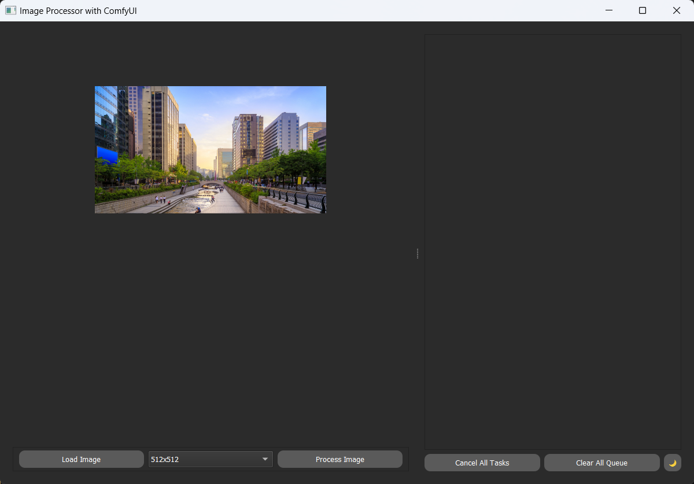

# Enhanced Resolution and Detail Workflow for Van Gogh Style Transfer

## Overview
We've developed an experimental pipeline to enhance the resolution and detail of our Van Gogh style transfer outputs. This pipeline introduces additional processing steps to achieve higher quality results.

## Key Features
- Secondary KSampler for refined detail processing
- Upscale Latent by node for resolution increase (1.5x input size)
- Additional VAE Decoder for final image generation

## Advantages
- Higher resolution outputs
- Improved detail preservation
- Enhanced stylistic coherence at larger scales

## Challenges
- Increased processing time (can more than double)
- Higher memory requirements

## Technical Insight
The pipeline operates in latent space, allowing for more coherent upscaling and detail enhancement. This approach offers superior quality for larger outputs but at the cost of increased computational demands.

## Performance Considerations
While the enhanced pipeline significantly improves output quality, users should be aware of the substantial increase in processing time. In some cases, execution time can more than double compared to the standard pipeline. This trade-off between quality and speed should be carefully evaluated based on specific project requirements and available resources.

## Future Directions
Ongoing work focuses on optimizing the pipeline to balance quality improvements with computational efficiency. We're exploring ways to mitigate the processing time increase while maintaining the enhanced output quality.
# PyQt5 Desktop Application

An experimental desktop application was developed using PyQt5 to provide a user-friendly interface for the ComfyUI workflow. The application’s primary goals include:

- **Launching a ComfyUI server in the background**
- **Presenting a simplified interface for end-users**
- **Managing all ComfyUI operations seamlessly**

This development effort resulted in significant progress, though not all planned features were completed at the time of project conclusion. Below is a summary of both the fully implemented features and the features still under development.

## Completed Features
- **ComfyUI Server Integration:** The application successfully launches and manages a ComfyUI server instance in the background without requiring direct user intervention.
- **User Interface Design:** A basic but functional interface was developed, allowing users to interact with key ComfyUI functionalities in an intuitive manner.
- **Task Queue Management:** All user actions are queued for sequential processing, ensuring orderly execution of tasks.
- **Task Status Tracking:** Completed tasks are marked as "Completed" in the queue but remain in the list for user reference.
- **Cancel Options:** Users can cancel individual tasks in the queue or choose to cancel all queued tasks at once.
- **Task Clearing:** A "Clear All Tasks" option allows users to remove all tasks from the queue with a single action.
- **Dark Mode & Light Mode Support:** The application supports both dark mode and light mode, allowing users to switch between themes as needed.
- **Progress Bar for Queue Items:** Each queued task is displayed with an associated progress bar, giving real-time feedback on task execution.
- **Task Preview on Double-Click:** Double-clicking a task in the queue brings it to the main screen for detailed view and interaction.

## Ongoing Development
- **Custom Output Management:** A feature to allow users to define custom output paths and formats for completed tasks is under development.
- **Output Image Preview:** The ability to display the output image directly within the application is currently being implemented.
- **Enhanced Error Management:** Improvements are being made to handle a wider range of errors with more robust and detailed reporting.
- **Full ComfyUI Integration:** Efforts are ongoing to achieve complete integration with ComfyUI, allowing the desktop application to support all advanced workflows and functionalities offered by ComfyUI.

