### Metric Definitions

The following metrics provide an overview of system performance and output quality. These metrics help assess both the computational efficiency and the similarity between the original inputs and the generated outputs.

#### Performance Metrics:
- **Execution Time**: The total time taken to complete the task, measured in seconds. This value reflects the computational speed and efficiency of the model.
- **GPU Model**: The specific Graphics Processing Unit (GPU) used during the process. GPU hardware plays a critical role in the speed and performance of deep learning models.
- **GPU Memory Usage Change**: The difference in GPU memory consumption before and after processing. A negative value indicates a reduction in memory usage, suggesting efficient memory management.

#### Similarity Metrics:
These metrics are used to measure how closely the generated output resembles the original input, which is crucial in evaluating the quality of the model’s performance:

- **SSIM (Structural Similarity Index)**: Measures the perceptual similarity between two images, where values closer to 1 indicate a higher structural similarity. A value of 0.9923 indicates a very high level of similarity.
- **Feature Similarity**: Assesses the similarity between the feature representations of the original and generated images. A value of 0.9976 represents an extremely high degree of feature alignment between the two images.
- **Perceptual Loss**: Evaluates the perceptual differences between the original and generated images. Lower values, such as 0.0002, indicate very minimal perceptual loss, suggesting that the generated image closely resembles the original in terms of visual perception.
- **Content Loss**: Measures the difference in content between the original and generated images. A lower content loss, like 0.0207, suggests that the generated image preserves most of the original content with only minor variations.
- **Style Loss**: Assesses the stylistic consistency between the generated and original images. A value of 0.0000 indicates that the style of the generated image matches perfectly with the style of the original, meaning there is no stylistic deviation.

## Image Comparison 1

| Original Image - **800x450** | Generated Image - **512x512** |
|:--------------:|:---------------:|
| 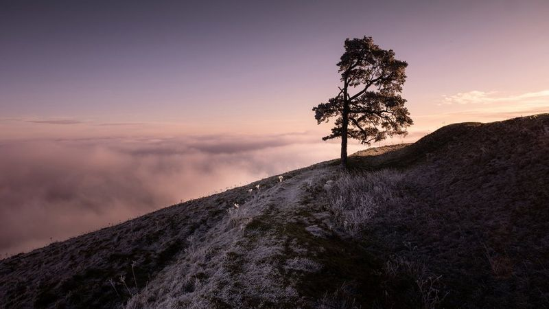 | 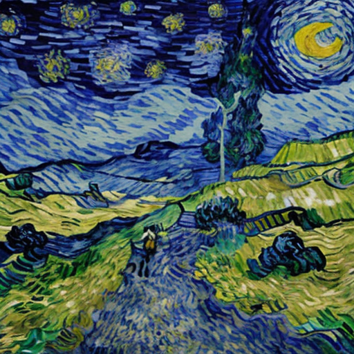 |
| Original Image 1 - Outdoor Scene  | Generated Image 1 - Model Output  |

### Performance Metrics

| Metric | Value |
|--------|-------|
| Execution Time | 153.94 seconds |
| GPU Model | NVIDIA GeForce GTX 1650 Ti |
| GPU Memory Usage Change | -112.29 MB |

#### Similarity Metrics
| Metric | Value | Interpretation |
|--------|-------|----------------|
| SSIM (Original vs Output) | 0.9923 | Çok Yüksek Benzerlik |
| Feature Similarity (Original vs Output) | 0.9976 | Çok Yüksek Benzerlik |
| Perceptual Loss (Original vs Output) | 0.0002 | Çok Yüksek Benzerlik |
| Content Loss (Original vs Output) | 0.0207 | Yüksek Benzerlik |
| Style Loss (Original vs Output) | 0.0000 | Çok Yüksek Benzerlik |

---

## Image Comparison 2

| Original Image - **1000x667** | Generated Image - **512x512** |
|:--------------:|:---------------:|
|  | 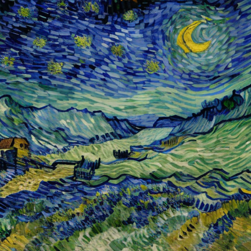 |
| Original Image 2 - Outdoor Scene  | Generated Image 2 - Model Output  |

### Performance Metrics

| Metric | Value |
|--------|-------|
| Execution Time | 105.41 seconds |
| GPU Model | NVIDIA GeForce GTX 1650 Ti |
| GPU Memory Usage Change | 0.00 MB |

#### Similarity Metrics
| Metric | Value | Interpretation |
|--------|-------|----------------|
| SSIM (Original vs Output) | 0.9931 | Çok Yüksek Benzerlik |
| Feature Similarity (Original vs Output) | 0.9980 | Çok Yüksek Benzerlik |
| Perceptual Loss (Original vs Output) | 0.0002 | Çok Yüksek Benzerlik |
| Content Loss (Original vs Output) | 0.0132 | Yüksek Benzerlik |
| Style Loss (Original vs Output) | 0.0000 | Çok Yüksek Benzerlik |

---

## Image Comparison 3

| Original Image - **830x415** | Generated Image - **512x512** |
|:--------------:|:---------------:|
|  | 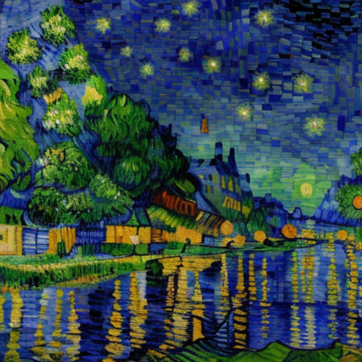 |
| Original Image 3 - Outdoor Scene  | Generated Image 3 - Model Output  |

### Performance Metrics

| Metric | Value |
|--------|-------|
| Execution Time | 606.66 seconds |
| GPU Model | NVIDIA GeForce GTX 1650 Ti |
| GPU Memory Usage Change | 0.00 MB |

#### Similarity Metrics
| Metric | Value | Interpretation |
|--------|-------|----------------|
| SSIM (Original vs Output) | 0.9912 | Çok Yüksek Benzerlik |
| Feature Similarity (Original vs Output) | 0.9985 | Çok Yüksek Benzerlik |
| Perceptual Loss (Original vs Output) | 0.0001 | Çok Yüksek Benzerlik |
| Content Loss (Original vs Output) | 0.0133 | Yüksek Benzerlik |
| Style Loss (Original vs Output) | 0.0000 | Çok Yüksek Benzerlik |

---

## Image Comparison 4

| Original Image - **640x359** | Generated Image - **512x512** |
|:--------------:|:---------------:|
|  | 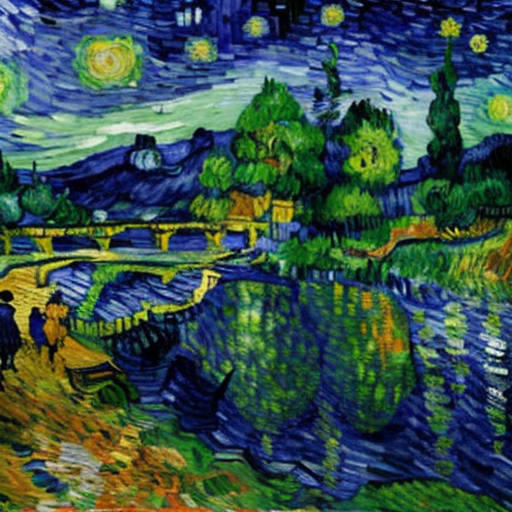 |
| Original Image 4 - Outdoor Scene  | Generated Image 4 - Model Output  |

### Performance Metrics

| Metric | Value |
|--------|-------|
| Execution Time | 92.72 seconds |
| GPU Model | NVIDIA GeForce GTX 1650 Ti |
| GPU Memory Usage Change | 0.00 MB |

#### Similarity Metrics
| Metric | Value | Interpretation |
|--------|-------|----------------|
| SSIM (Original vs Output) | 0.9905 | Çok Yüksek Benzerlik |
| Feature Similarity (Original vs Output) | 0.9983 | Çok Yüksek Benzerlik |
| Perceptual Loss (Original vs Output) | 0.0002 | Çok Yüksek Benzerlik |
| Content Loss (Original vs Output) | 0.0154 | Yüksek Benzerlik |
| Style Loss (Original vs Output) | 0.0000 | Çok Yüksek Benzerlik |

---

## Image Comparison 5

| Original Image - **600x397** | Generated Image - **512x512** |
|:--------------:|:---------------:|
| 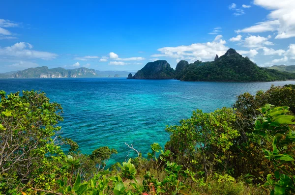 | 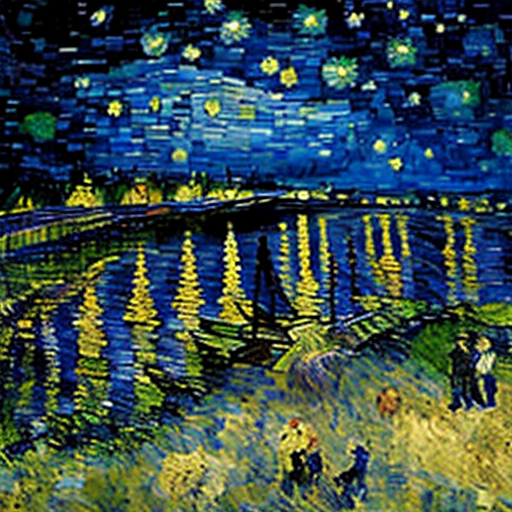 |
| Original Image 5 - Outdoor Scene  | Generated Image 5 - Model Output |

### Performance Metrics

| Metric | Value |
|--------|-------|
| Execution Time | 448.20 seconds |
| GPU Model | NVIDIA GeForce GTX 1650 Ti |
| GPU Memory Usage Change | 0.00 MB |

#### Similarity Metrics
| Metric | Value | Interpretation |
|--------|-------|----------------|
| SSIM (Original vs Output) | 0.9873 | Çok Yüksek Benzerlik |
| Feature Similarity (Original vs Output) | 0.9934 | Çok Yüksek Benzerlik |
| Perceptual Loss (Original vs Output) | 0.0006 | Çok Yüksek Benzerlik |
| Content Loss (Original vs Output) | 0.0512 | Yüksek Benzerlik |
| Style Loss (Original vs Output) | 0.0000 | Çok Yüksek Benzerlik |

---

## Image Comparison 6

| Original Image - **4000x2200** | Generated Image - **512x512** |
|:--------------:|:---------------:|
|  | 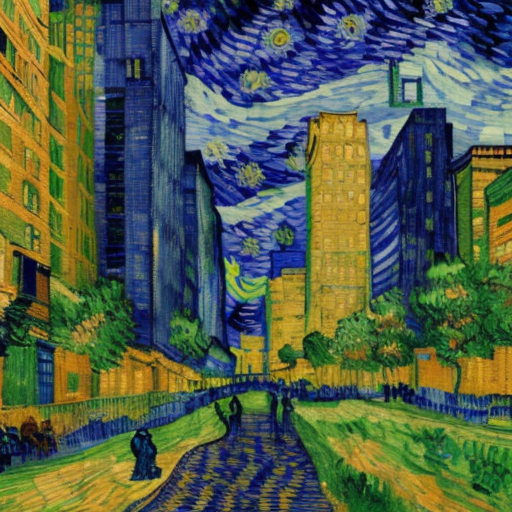 |
| Original Image 6 - Outdoor Scene  | Generated Image 6 - Model Output |

### Performance Metrics

| Metric | Value |
|--------|-------|
| Execution Time | 100.35 seconds |
| GPU Model | NVIDIA GeForce GTX 1650 Ti |
| GPU Memory Usage Change | 0.00 MB |

#### Similarity Metrics
| Metric | Value | Interpretation |
|--------|-------|----------------|
| SSIM (Original vs Output) | 0.9908 | Çok Yüksek Benzerlik |
| Feature Similarity (Original vs Output) | 0.9985 | Çok Yüksek Benzerlik |
| Perceptual Loss (Original vs Output) | 0.0001 | Çok Yüksek Benzerlik |
| Content Loss (Original vs Output) | 0.0124 | Yüksek Benzerlik |
| Style Loss (Original vs Output) | 0.0000 | Çok Yüksek Benzerlik |

---

## Image Comparison 7

| Original Image - **1920x1080** | Generated Image - **512x512** |
|:--------------:|:---------------:|
| 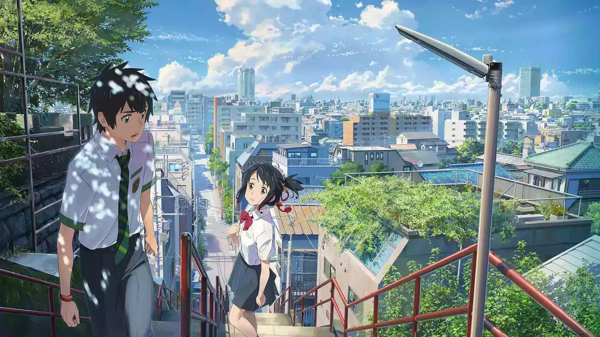 | 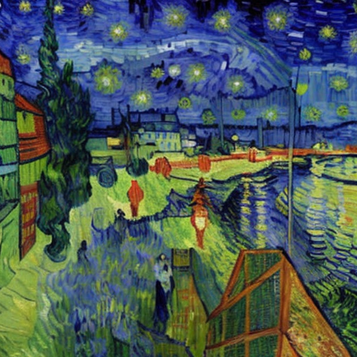 |
| Original Image 7 - Outdoor Scene  | Generated Image 7 - Model Output |

### Performance Metrics

| Metric | Value |
|--------|-------|
| Execution Time | 286.12 seconds |
| GPU Model | NVIDIA GeForce GTX 1650 Ti |
| GPU Memory Usage Change | 0.00 MB |

#### Similarity Metrics
| Metric | Value | Interpretation |
|--------|-------|----------------|
| SSIM (Original vs Output) | 0.9920 | Çok Yüksek Benzerlik |
| Feature Similarity (Original vs Output) | 0.9991 | Çok Yüksek Benzerlik |
| Perceptual Loss (Original vs Output) | 0.0001 | Çok Yüksek Benzerlik |
| Content Loss (Original vs Output) | 0.0138 | Yüksek Benzerlik |
| Style Loss (Original vs Output) | 0.0000 | Çok Yüksek Benzerlik |

---

## Image Comparison 8

| Original Image - **1280x720** | Generated Image - **512x512** |
|:--------------:|:---------------:|
| 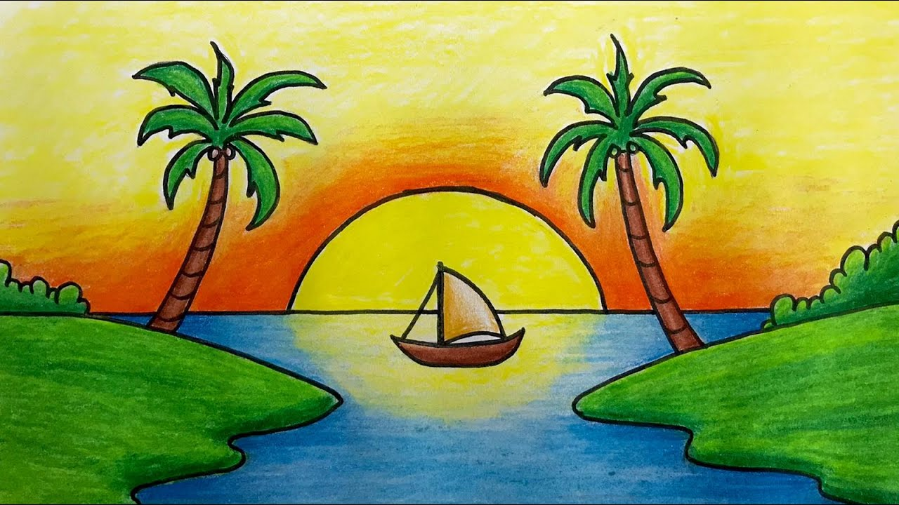 | 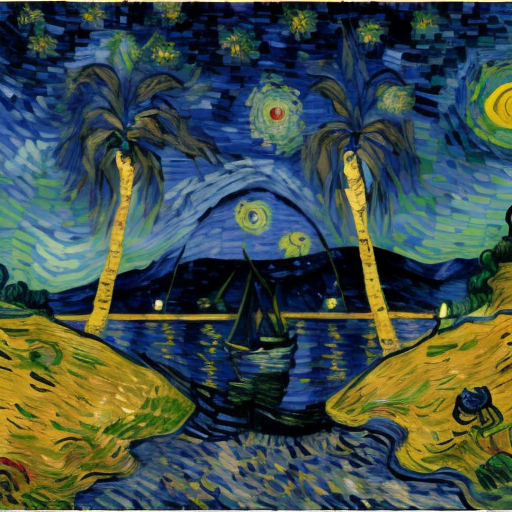 |
| Original Image 8 - Painting  | Generated Image 8 - Model Output |

### Performance Metrics

| Metric | Value |
|--------|-------|
| Execution Time | 100.87 seconds |
| GPU Model | NVIDIA GeForce GTX 1650 Ti |
| GPU Memory Usage Change | 0.00 MB |

#### Similarity Metrics
| Metric | Value | Interpretation |
|--------|-------|----------------|
| SSIM (Original vs Output) | 0.9898 | Çok Yüksek Benzerlik |
| Feature Similarity (Original vs Output) | 0.9979 | Çok Yüksek Benzerlik |
| Perceptual Loss (Original vs Output) | 0.0002 | Çok Yüksek Benzerlik |
| Content Loss (Original vs Output) | 0.0162 | Yüksek Benzerlik |
| Style Loss (Original vs Output) | 0.0000 | Çok Yüksek Benzerlik |

---

## Image Comparison 9

| Original Image - **735x431** | Generated Image - **512x512** |
|:--------------:|:---------------:|
| 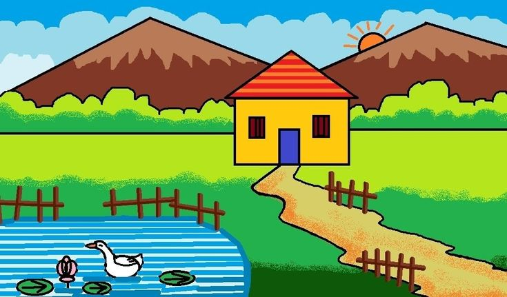 | 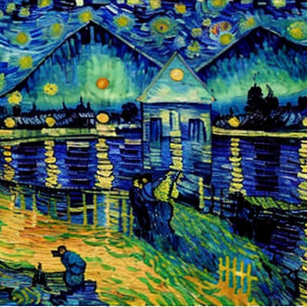 |
| Original Image 9 -  Painting  | Generated Image 9 - Model Output |

### Performance Metrics

| Metric | Value |
|--------|-------|
| Execution Time | 200.20 seconds |
| GPU Model | NVIDIA GeForce GTX 1650 Ti |
| GPU Memory Usage Change | 0.00 MB |

#### Similarity Metrics
| Metric | Value | Interpretation |
|--------|-------|----------------|
| SSIM (Original vs Output) | 0.9887 | Çok Yüksek Benzerlik |
| Feature Similarity (Original vs Output) | 0.9945 | Çok Yüksek Benzerlik |
| Perceptual Loss (Original vs Output) | 0.0002 | Çok Yüksek Benzerlik |
| Content Loss (Original vs Output) | 0.0264 | Yüksek Benzerlik |
| Style Loss (Original vs Output) | 0.0000 | Çok Yüksek Benzerlik |

---

## Image Comparison 10

| Original Image - **736x456** | Generated Image - **512x512** |
|:--------------:|:---------------:|
| 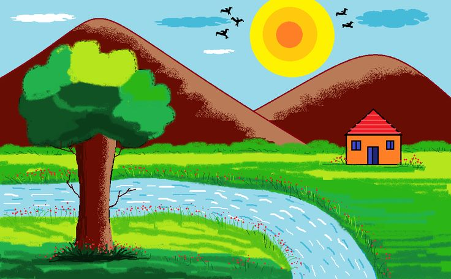 | 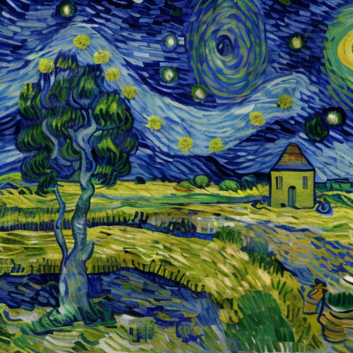 |
| Original Image 10 -  Painting  | Generated Image 10 - Model Output |

### Performance Metrics

| Metric | Value |
|--------|-------|
| Execution Time | 97.71 seconds |
| GPU Model | NVIDIA GeForce GTX 1650 Ti |
| GPU Memory Usage Change | 0.00 MB |

#### Similarity Metrics
| Metric | Value | Interpretation |
|--------|-------|----------------|
| SSIM (Original vs Output) | 0.9917 | Çok Yüksek Benzerlik |
| Feature Similarity (Original vs Output) | 0.9970 | Çok Yüksek Benzerlik |
| Perceptual Loss (Original vs Output) | 0.0002 | Çok Yüksek Benzerlik |
| Content Loss (Original vs Output) | 0.0140 | Yüksek Benzerlik |
| Style Loss (Original vs Output) | 0.0000 | Çok Yüksek Benzerlik |

---

## Image Comparison 11

| Original Image - **1200x900** | Generated Image - **512x512** |
|:--------------:|:---------------:|
| 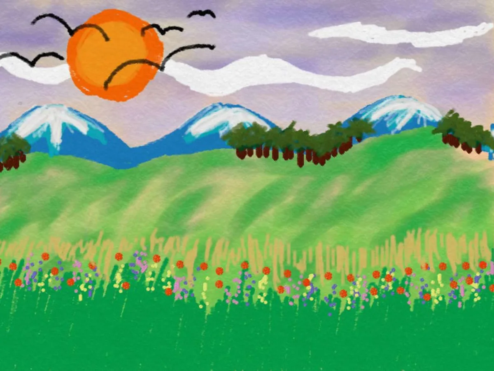 | 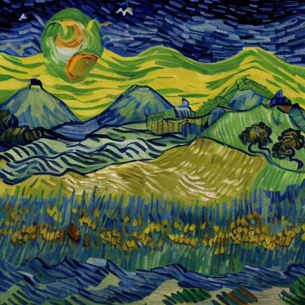 |
| Original Image 11 -  Painting  | Generated Image 11 - Model Output |

### Performance Metrics

| Metric | Value |
|--------|-------|
| Execution Time | 96.61 seconds |
| GPU Model | NVIDIA GeForce GTX 1650 Ti |
| GPU Memory Usage Change | 0.00 MB |

#### Similarity Metrics
| Metric | Value | Interpretation |
|--------|-------|----------------|
| SSIM (Original vs Output) | 0.9917 | Çok Yüksek Benzerlik |
| Feature Similarity (Original vs Output) | 0.9985 | Çok Yüksek Benzerlik |
| Perceptual Loss (Original vs Output) | 0.0002 | Çok Yüksek Benzerlik |
| Content Loss (Original vs Output) | 0.0187 | Yüksek Benzerlik |
| Style Loss (Original vs Output) | 0.0000 | Çok Yüksek Benzerlik |

---

## Image Comparison 12

| Original Image - **735x455** | Generated Image - **512x512** |
|:--------------:|:---------------:|
| 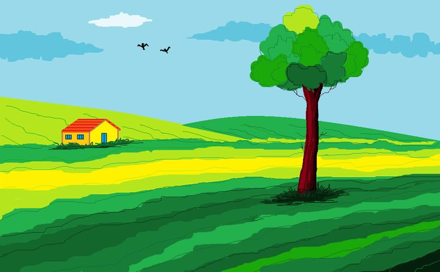 | 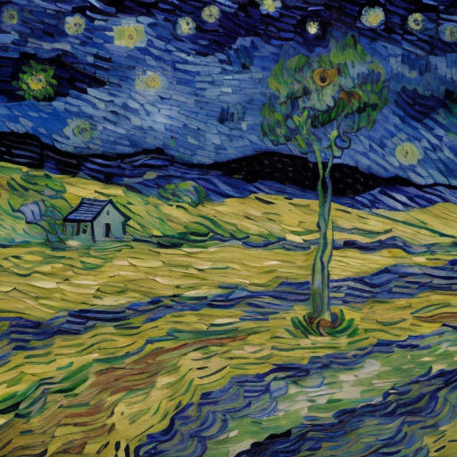 |
| Original Image 12 -  Painting  | Generated Image 12 - Model Output |

### Performance Metrics

| Metric | Value |
|--------|-------|
| Execution Time | 796.35 seconds |
| GPU Model | NVIDIA GeForce GTX 1650 Ti |
| GPU Memory Usage Change | 0.00 MB |

#### Similarity Metrics
| Metric | Value | Interpretation |
|--------|-------|----------------|
| SSIM (Original vs Output) | 0.9893 | Çok Yüksek Benzerlik |
| Feature Similarity (Original vs Output) | 0.9985 | Çok Yüksek Benzerlik |
| Perceptual Loss (Original vs Output) | 0.0002 | Çok Yüksek Benzerlik |
| Content Loss (Original vs Output) | 0.0155 | Yüksek Benzerlik |
| Style Loss (Original vs Output) | 0.0000 | Çok Yüksek Benzerlik |

---

## Image Comparison 13

| Original Image - **1024x512** | Generated Image - **512x512** |
|:--------------:|:---------------:|
|  |  |
| Original Image 13 -  Painting  | Generated Image 13 - Model Output |

### Performance Metrics

| Metric | Value |
|--------|-------|
| Execution Time | 105.73 seconds |
| GPU Model | NVIDIA GeForce GTX 1650 Ti |
| GPU Memory Usage Change | 507.68 MB |

#### Similarity Metrics
| Metric | Value | Interpretation |
|--------|-------|----------------|
| SSIM (Original vs Output) | 0.9909 | Çok Yüksek Benzerlik |
| Feature Similarity (Original vs Output) | 0.9994 | Çok Yüksek Benzerlik |
| Perceptual Loss (Original vs Output) | 0.0001 | Çok Yüksek Benzerlik |
| Content Loss (Original vs Output) | 0.0139 | Yüksek Benzerlik |
| Style Loss (Original vs Output) | 0.0000 | Çok Yüksek Benzerlik |

---

## Image Comparison 14

| Original Image - **680x306** | Generated Image - **512x512** |
|:--------------:|:---------------:|
| 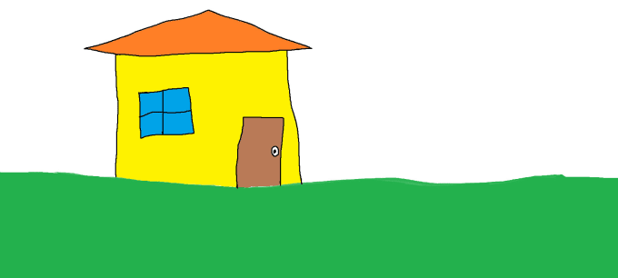 | 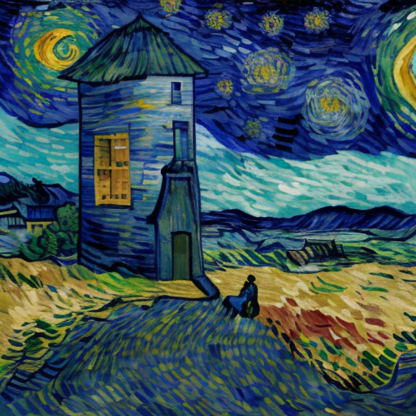 |
| Original Image 14 -  Painting  | Generated Image 14 - Model Output |

### Performance Metrics

| Metric | Value |
|--------|-------|
| Execution Time | 349.89 seconds |
| GPU Model | NVIDIA GeForce GTX 1650 Ti |
| GPU Memory Usage Change | -0.28 MB |

#### Similarity Metrics
| Metric | Value | Interpretation |
|--------|-------|----------------|
| SSIM (Original vs Output) | 0.9915 | Çok Yüksek Benzerlik |
| Feature Similarity (Original vs Output) | 0.9968 | Çok Yüksek Benzerlik |
| Perceptual Loss (Original vs Output) | 0.0002 | Çok Yüksek Benzerlik |
| Content Loss (Original vs Output) | 0.0208 | Yüksek Benzerlik |
| Style Loss (Original vs Output) | 0.0000 | Çok Yüksek Benzerlik |

---

## Image Comparison 15

| Original Image - **910x569** | Generated Image - **512x512** |
|:--------------:|:---------------:|
| 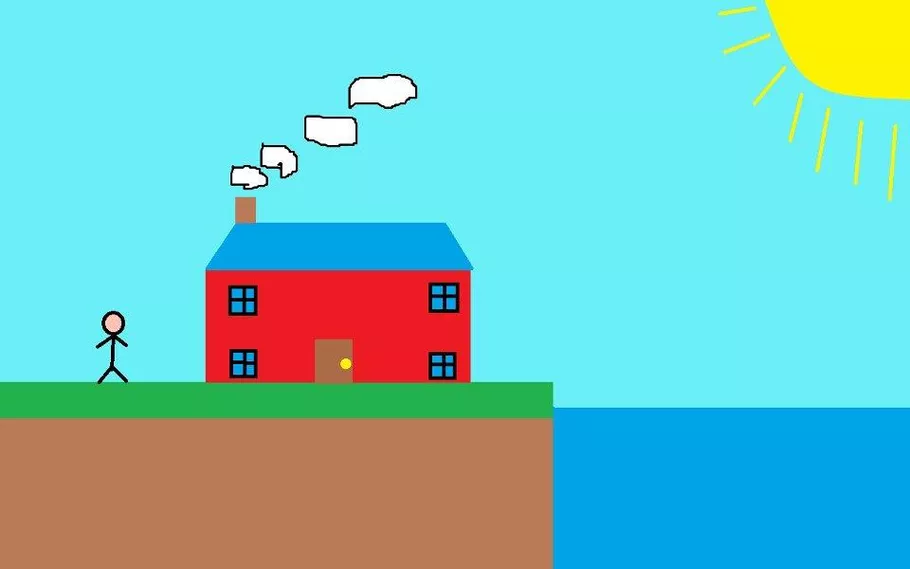 | 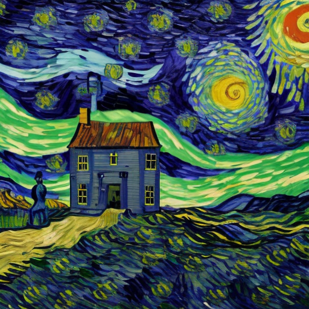 |
| Original Image 15 -  Painting  | Generated Image 15 - Model Output |

### Performance Metrics

| Metric | Value |
|--------|-------|
| Execution Time | 339.10 seconds |
| GPU Model | NVIDIA GeForce GTX 1650 Ti |
| GPU Memory Usage Change | 0.00 MB |

#### Similarity Metrics
| Metric | Value | Interpretation |
|--------|-------|----------------|
| SSIM (Original vs Output) | 0.9914 | Çok Yüksek Benzerlik |
| Feature Similarity (Original vs Output) | 0.9969 | Çok Yüksek Benzerlik |
| Perceptual Loss (Original vs Output) | 0.0002 | Çok Yüksek Benzerlik |
| Content Loss (Original vs Output) | 0.0169 | Yüksek Benzerlik |
| Style Loss (Original vs Output) | 0.0000 | Çok Yüksek Benzerlik |

---

## Image Comparison 16

| Original Image - **402x599** | Generated Image - **512x512** |
|:--------------:|:---------------:|
| 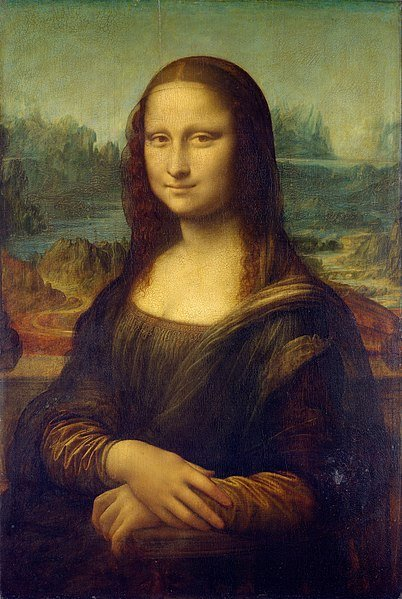 | 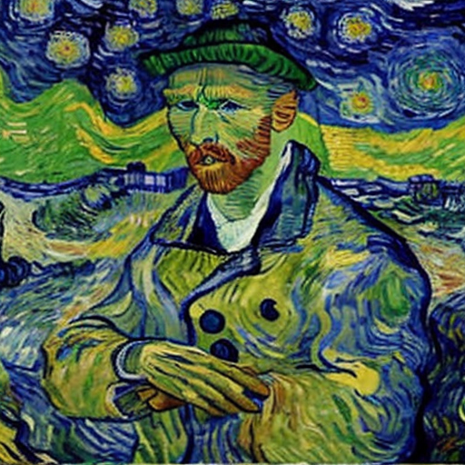 |
| Original Image 16 - Artwork  | Generated Image 16 - Model Output |

### Performance Metrics

| Metric | Value |
|--------|-------|
| Execution Time | 592.36 seconds |
| GPU Model | NVIDIA GeForce GTX 1650 Ti |
| GPU Memory Usage Change | 0.00 MB |

#### Similarity Metrics
| Metric | Value | Interpretation |
|--------|-------|----------------|
| SSIM (Original vs Output) | 0.9914 | Çok Yüksek Benzerlik |
| Feature Similarity (Original vs Output) | 0.9959 | Çok Yüksek Benzerlik |
| Perceptual Loss (Original vs Output) | 0.0002 | Çok Yüksek Benzerlik |
| Content Loss (Original vs Output) | 0.0154 | Yüksek Benzerlik |
| Style Loss (Original vs Output) | 0.0000 | Çok Yüksek Benzerlik |

---

## Image Comparison 17

| Original Image - **1015x1200** | Generated Image - **512x512** |
|:--------------:|:---------------:|
| 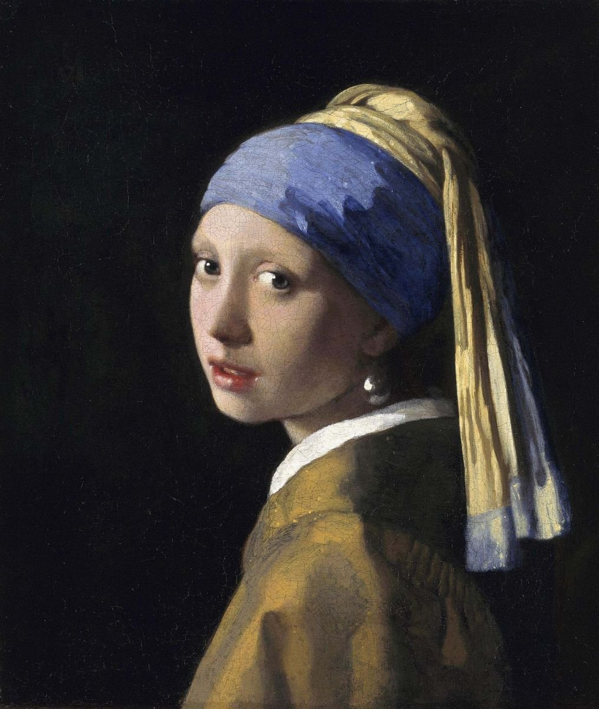 | 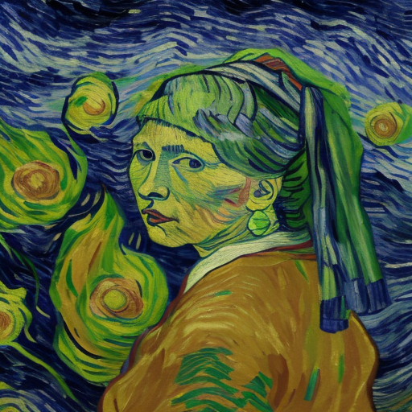 |
| Original Image 17 - Artwork  | Generated Image 17 - Model Output |

### Performance Metrics

| Metric | Value |
|--------|-------|
| Execution Time | 404.72 seconds |
| GPU Model | NVIDIA GeForce GTX 1650 Ti |
| GPU Memory Usage Change | 0.00 MB |

#### Similarity Metrics
| Metric | Value | Interpretation |
|--------|-------|----------------|
| SSIM (Original vs Output) | 0.9885 | Çok Yüksek Benzerlik |
| Feature Similarity (Original vs Output) | 0.9979 | Çok Yüksek Benzerlik |
| Perceptual Loss (Original vs Output) | 0.0002 | Çok Yüksek Benzerlik |
| Content Loss (Original vs Output) | 0.0172 | Yüksek Benzerlik |
| Style Loss (Original vs Output) | 0.0000 | Çok Yüksek Benzerlik |

---

## Image Comparison 18

| Original Image - **900x1085** | Generated Image - **512x512** |
|:--------------:|:---------------:|
| 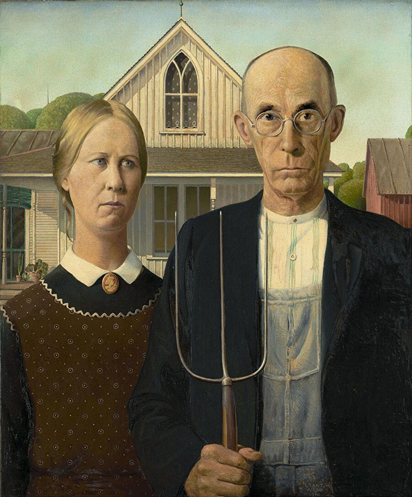 | 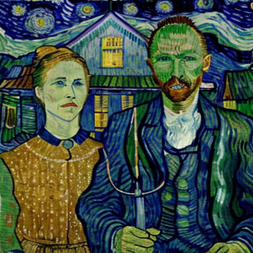 |
| Original Image 18 - Artwork  | Generated Image 18 - Model Output |

### Performance Metrics

| Metric | Value |
|--------|-------|
| Execution Time | 307.56 seconds |
| GPU Model | NVIDIA GeForce GTX 1650 Ti |
| GPU Memory Usage Change | 0.00 MB |

#### Similarity Metrics
| Metric | Value | Interpretation |
|--------|-------|----------------|
| SSIM (Original vs Output) | 0.9904 | Çok Yüksek Benzerlik |
| Feature Similarity (Original vs Output) | 0.9983 | Çok Yüksek Benzerlik |
| Perceptual Loss (Original vs Output) | 0.0002 | Çok Yüksek Benzerlik |
| Content Loss (Original vs Output) | 0.0171 | Yüksek Benzerlik |
| Style Loss (Original vs Output) | 0.0000 | Çok Yüksek Benzerlik |

---

## Image Comparison 19

| Original Image - **345x343** | Generated Image - **512x512** |
|:--------------:|:---------------:|
| 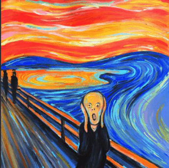 | 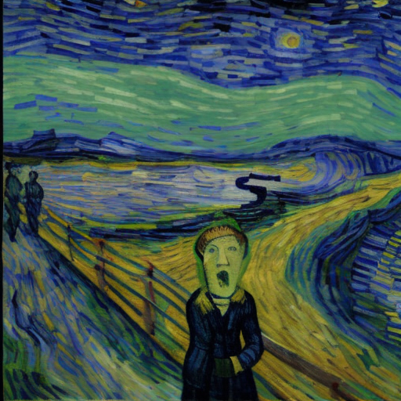 |
| Original Image 19 - Artwork  | Generated Image 19 - Model Output |

### Performance Metrics

| Metric | Value |
|--------|-------|
| Execution Time | 633.73 seconds |
| GPU Model | NVIDIA GeForce GTX 1650 Ti |
| GPU Memory Usage Change | 0.00 MB |

#### Similarity Metrics
| Metric | Value | Interpretation |
|--------|-------|----------------|
| SSIM (Original vs Output) | 0.9895 | Çok Yüksek Benzerlik |
| Feature Similarity (Original vs Output) | 0.9950 | Çok Yüksek Benzerlik |
| Perceptual Loss (Original vs Output) | 0.0002 | Çok Yüksek Benzerlik |
| Content Loss (Original vs Output) | 0.0224 | Yüksek Benzerlik |
| Style Loss (Original vs Output) | 0.0000 | Çok Yüksek Benzerlik |

---

## Image Comparison 20

| Original Image - **1024x730** | Generated Image - **512x512** |
|:--------------:|:---------------:|
| 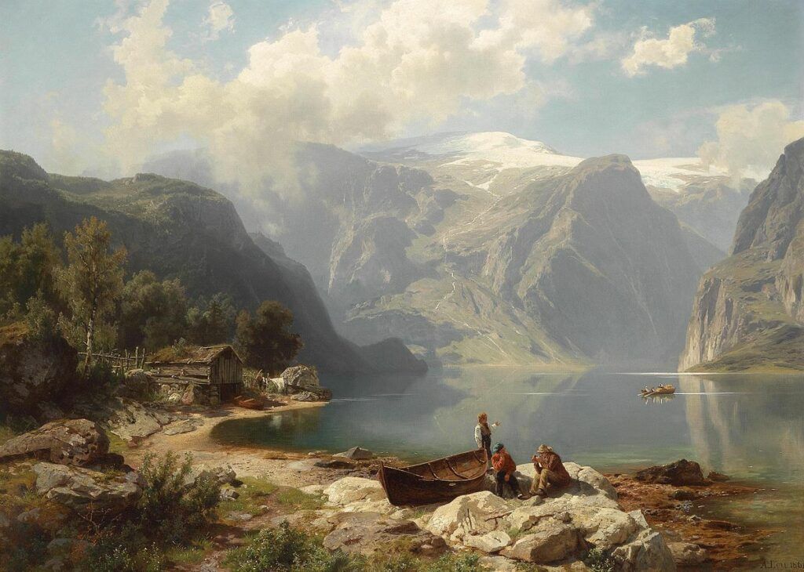 | 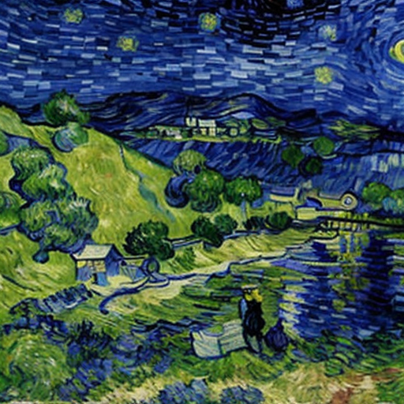 |
| Original Image 20 - Artwork  | Generated Image 20 - Model Output |

### Performance Metrics

| Metric | Value |
|--------|-------|
| Execution Time | 450.47 seconds |
| GPU Model | NVIDIA GeForce GTX 1650 Ti |
| GPU Memory Usage Change | 0.00 MB |

#### Similarity Metrics
| Metric | Value | Interpretation |
|--------|-------|----------------|
| SSIM (Original vs Output) | 0.9905 | Çok Yüksek Benzerlik |
| Feature Similarity (Original vs Output) | 0.9975 | Çok Yüksek Benzerlik |
| Perceptual Loss (Original vs Output) | 0.0002 | Çok Yüksek Benzerlik |
| Content Loss (Original vs Output) | 0.0172 | Yüksek Benzerlik |
| Style Loss (Original vs Output) | 0.0000 | Çok Yüksek Benzerlik |

---

## Image Comparison 21

| Original Image - **1000x508** | Generated Image - **512x512** |
|:--------------:|:---------------:|
| 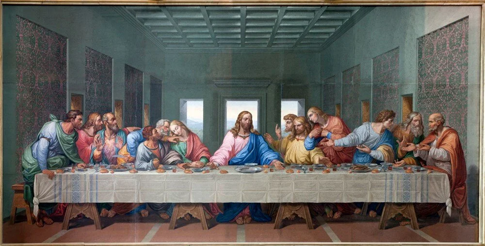 | 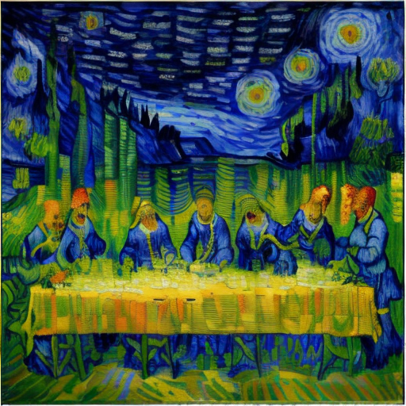 |
| Original Image 21 - Artwork  | Generated Image 21 - Model Output |

### Performance Metrics

| Metric | Value |
|--------|-------|
| Execution Time | 72081.05 seconds |
| GPU Model | NVIDIA GeForce GTX 1650 Ti |
| GPU Memory Usage Change | 0.00 MB |

#### Similarity Metrics
| Metric | Value | Interpretation |
|--------|-------|----------------|
| SSIM (Original vs Output) | 0.9884 | Çok Yüksek Benzerlik |
| Feature Similarity (Original vs Output) | 0.9988 | Çok Yüksek Benzerlik |
| Perceptual Loss (Original vs Output) | 0.0002 | Çok Yüksek Benzerlik |
| Content Loss (Original vs Output) | 0.0153 | Yüksek Benzerlik |
| Style Loss (Original vs Output) | 0.0000 | Çok Yüksek Benzerlik |

---

## Image Comparison 22

| Original Image - **640x360** | Generated Image - **512x512** |
|:--------------:|:---------------:|
| 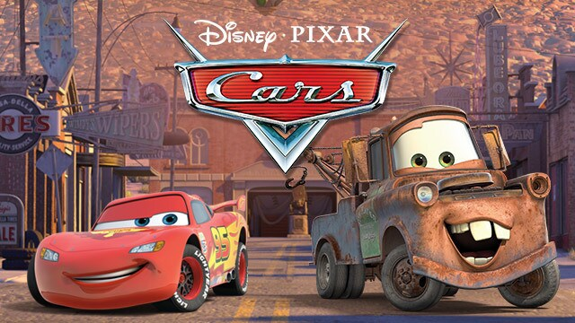 | 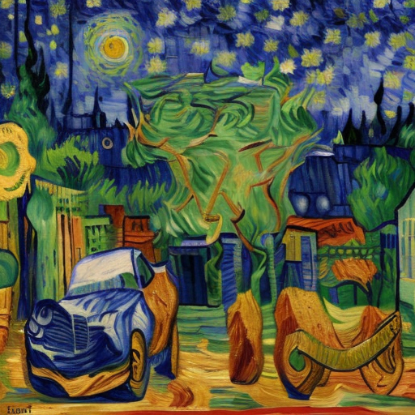 |
| Original Image 22 - Vehicles  | Generated Image 22 - Model Output |

### Performance Metrics

| Metric | Value |
|--------|-------|
| Execution Time | 135.18 seconds |
| GPU Model | NVIDIA GeForce GTX 1650 Ti |
| GPU Memory Usage Change | 0.00 MB |

#### Similarity Metrics
| Metric | Value | Interpretation |
|--------|-------|----------------|
| SSIM (Original vs Output) | 0.9898 | Çok Yüksek Benzerlik |
| Feature Similarity (Original vs Output) | 0.9984 | Çok Yüksek Benzerlik |
| Perceptual Loss (Original vs Output) | 0.0002 | Çok Yüksek Benzerlik |
| Content Loss (Original vs Output) | 0.0146 | Yüksek Benzerlik |
| Style Loss (Original vs Output) | 0.0000 | Çok Yüksek Benzerlik |

---

## Image Comparison 23

| Original Image - **1400x923** | Generated Image - **512x512** |
|:--------------:|:---------------:|
|  | 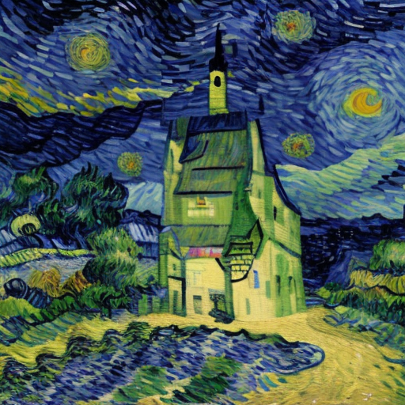 |
| Original Image 23 - Vehicles  | Generated Image 23 - Model Output |

### Performance Metrics

| Metric | Value |
|--------|-------|
| Execution Time | 157.97 seconds |
| GPU Model | NVIDIA GeForce GTX 1650 Ti |
| GPU Memory Usage Change | 0.00 MB |

#### Similarity Metrics
| Metric | Value | Interpretation |
|--------|-------|----------------|
| SSIM (Original vs Output) | 0.9920 | Çok Yüksek Benzerlik |
| Feature Similarity (Original vs Output) | 0.9980 | Çok Yüksek Benzerlik |
| Perceptual Loss (Original vs Output) | 0.0002 | Çok Yüksek Benzerlik |
| Content Loss (Original vs Output) | 0.0144 | Yüksek Benzerlik |
| Style Loss (Original vs Output) | 0.0000 | Çok Yüksek Benzerlik |

---

## Image Comparison 24

| Original Image - **800x800** | Generated Image - **512x512** |
|:--------------:|:---------------:|
| 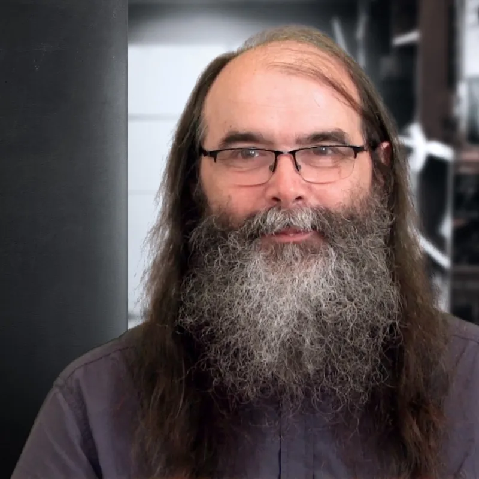 | 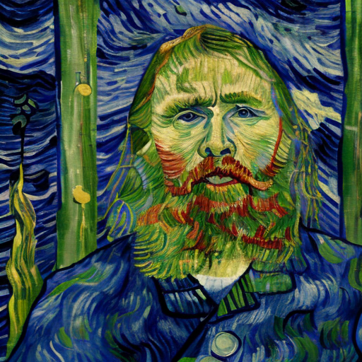 |
| Original Image 24 - Portraits and People  | Generated Image 24 - Model Output |

### Performance Metrics

| Metric | Value |
|--------|-------|
| Execution Time | 140.17 seconds |
| GPU Model | NVIDIA GeForce GTX 1650 Ti |
| GPU Memory Usage Change | 0.00 MB |

#### Similarity Metrics
| Metric | Value | Interpretation |
|--------|-------|----------------|
| SSIM (Original vs Output) | 0.9900 | Çok Yüksek Benzerlik |
| Feature Similarity (Original vs Output) | 0.9945 | Çok Yüksek Benzerlik |
| Perceptual Loss (Original vs Output) | 0.0003 | Çok Yüksek Benzerlik |
| Content Loss (Original vs Output) | 0.0370 | Yüksek Benzerlik |
| Style Loss (Original vs Output) | 0.0000 | Çok Yüksek Benzerlik |

---

## Image Comparison 25

| Original Image - **700x400** | Generated Image - **512x512** |
|:--------------:|:---------------:|
| 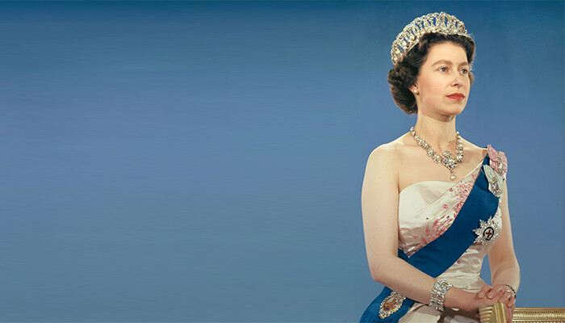 | 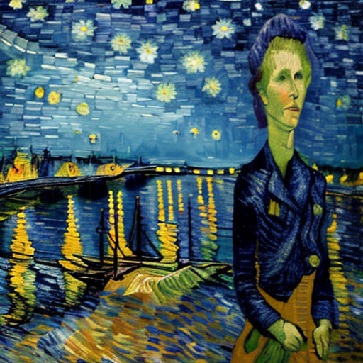 |
| Original Image 25 - Portraits and People  | Generated Image 25 - Model Output |

### Performance Metrics

| Metric | Value |
|--------|-------|
| Execution Time | 155.36 seconds |
| GPU Model | NVIDIA GeForce GTX 1650 Ti |
| GPU Memory Usage Change | 0.00 MB |

#### Similarity Metrics
| Metric | Value | Interpretation |
|--------|-------|----------------|
| SSIM (Original vs Output) | 0.9877 | Çok Yüksek Benzerlik |
| Feature Similarity (Original vs Output) | 0.9968 | Çok Yüksek Benzerlik |
| Perceptual Loss (Original vs Output) | 0.0001 | Çok Yüksek Benzerlik |
| Content Loss (Original vs Output) | 0.0165 | Yüksek Benzerlik |
| Style Loss (Original vs Output) | 0.0000 | Çok Yüksek Benzerlik |

---

## Image Comparison 26

| Original Image - **1200x675** | Generated Image - **512x512** |
|:--------------:|:---------------:|
| 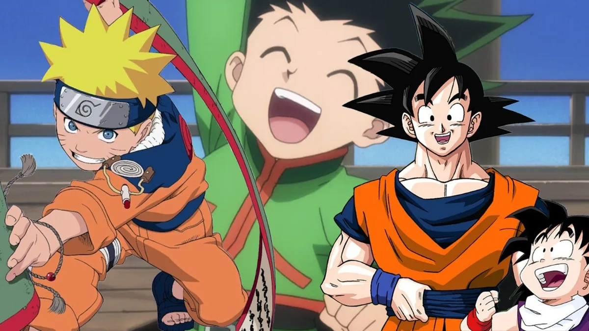 | 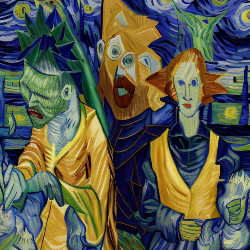 |
| Original Image 26 - Portraits and People  | Generated Image 26 - Model Output |

### Performance Metrics

| Metric | Value |
|--------|-------|
| Execution Time | 155.36 seconds |
| GPU Model | NVIDIA GeForce GTX 1650 Ti |
| GPU Memory Usage Change | 0.00 MB |

#### Similarity Metrics
| Metric | Value | Interpretation |
|--------|-------|----------------|
| SSIM (Original vs Output) | 0.9877 | Çok Yüksek Benzerlik |
| Feature Similarity (Original vs Output) | 0.9968 | Çok Yüksek Benzerlik |
| Perceptual Loss (Original vs Output) | 0.0001 | Çok Yüksek Benzerlik |
| Content Loss (Original vs Output) | 0.0165 | Yüksek Benzerlik |
| Style Loss (Original vs Output) | 0.0000 | Çok Yüksek Benzerlik |

---

## Image Comparison 27

| Original Image - **1280x720** | Generated Image - **512x512** |
|:--------------:|:---------------:|
|  | 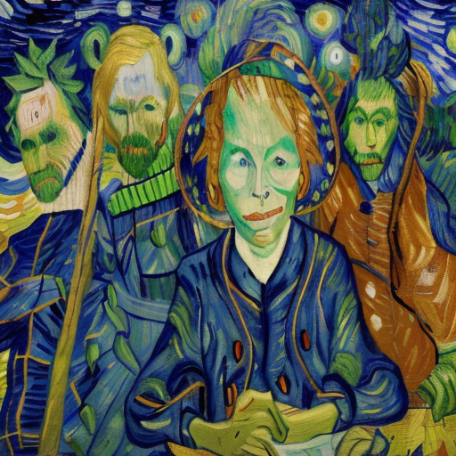 |
| Original Image 27 - Portraits and People  | Generated Image 27 - Model Output |

### Performance Metrics

| Metric | Value |
|--------|-------|
| Execution Time | 164.35 seconds |
| GPU Model | NVIDIA GeForce GTX 1650 Ti |
| GPU Memory Usage Change | 0.00 MB |

#### Similarity Metrics
| Metric | Value | Interpretation |
|--------|-------|----------------|
| SSIM (Original vs Output) | 0.9909 | Çok Yüksek Benzerlik |
| Feature Similarity (Original vs Output) | 0.9977 | Çok Yüksek Benzerlik |
| Perceptual Loss (Original vs Output) | 0.0001 | Çok Yüksek Benzerlik |
| Content Loss (Original vs Output) | 0.0142 | Yüksek Benzerlik |
| Style Loss (Original vs Output) | 0.0000 | Çok Yüksek Benzerlik |

---

## Performance and Reliability Assessment

The performance metrics presented in this report were calculated using third-party functions, which introduces a potential element of uncertainty regarding their absolute reliability. Initial analysis of these metrics has raised some concerns about their consistency and accuracy, suggesting that further in-depth investigation is warranted to validate the results. It is crucial to approach these quantitative measures with a degree of caution and to consider them as preliminary indicators rather than definitive assessments.

Notwithstanding these caveats, a qualitative examination of the input-output pairs reveals remarkably promising results. The visual fidelity and stylistic coherence between the original images and their generated counterparts demonstrate a high level of success in the model's performance. This subjective evaluation, while not quantifiable in the same manner as the metrics, provides compelling evidence of the model's effectiveness in achieving its intended objectives.

Given this dichotomy between the quantitative metrics and qualitative observations, we recommend a two-pronged approach for future analysis:

1. A comprehensive audit of the metric calculation methodologies, including potential implementation of alternative measurement techniques for cross-validation.
2. A structured qualitative assessment framework to systematically capture and analyze the subjective aspects of the model's output quality.

This balanced approach will provide a more holistic understanding of the model's true performance and capabilities, ensuring that both objective and perceptual qualities are adequately considered in the evaluation process.

